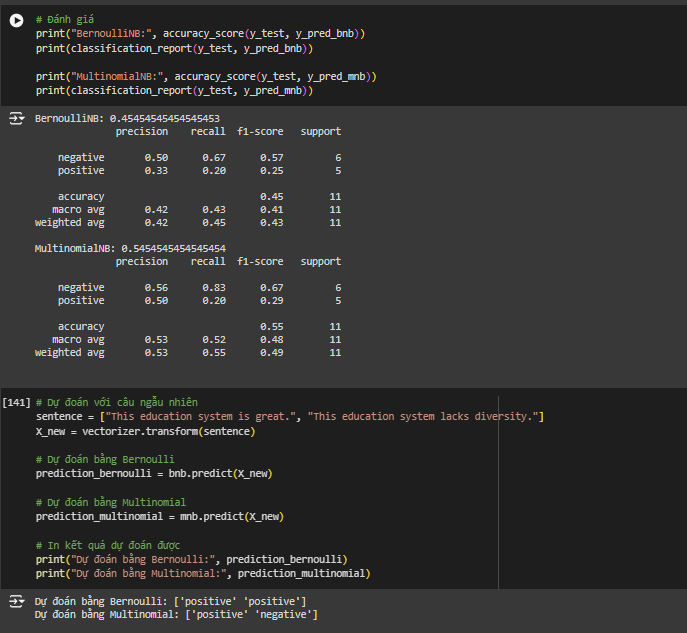
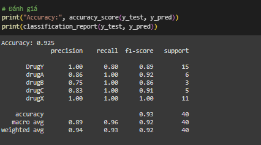

<h1>ML_Lab_2</h1>

## 1. Công nghệ sử dụng:

 - Framework: pandas, sckit-learn

## 2. Thuật toán:

 - Naive Bayes (Phân phối Bernoulli, Multinomial và Gaussian)

## 3. Hiển thị kết quả lên website:

## 4. So sánh 2 của 2 phân phối Bernoulli và Multinomial, Đánh giá mô hình phân phối Gaussian:

 - Câu 1:

 - Câu 2:

